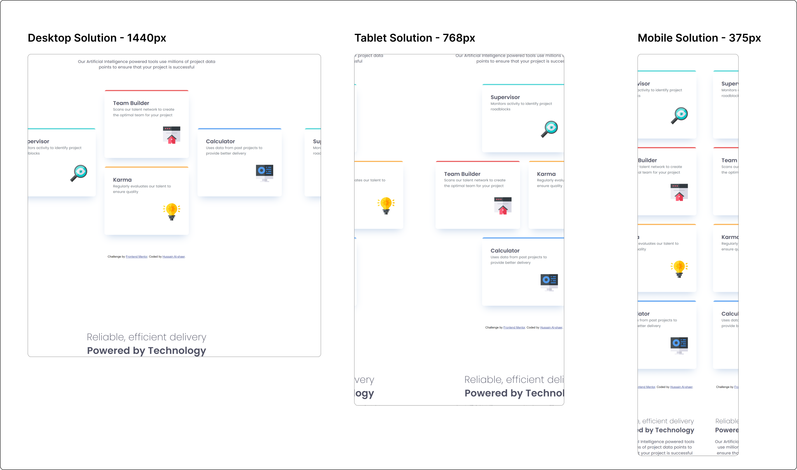

# Frontend Mentor - Four card feature section solution

This is a solution to the [Four card feature section challenge on Frontend Mentor](https://www.frontendmentor.io/challenges/four-card-feature-section-weK1eFYK). Frontend Mentor challenges help you improve your coding skills by building realistic projects.

## Table of contents

- [Overview](#overview)
  - [The challenge](#the-challenge)
  - [Screenshot](#screenshot)
  - [Links](#links)
- [My process](#my-process)
  - [Built with](#built-with)
  - [What I learned](#what-i-learned)
  - [Useful resources](#useful-resources)

## Overview

### The challenge

Users should be able to:

- View the optimal layout for the site depending on their device's screen size

### Screenshot

### Links

- Solution URL: [Solution URL](https://github.com/hussaindev94/frontend-mentor-challengs-four-card-feature-section)
- Live Site URL: [Live site URL](https://hussaindev94.github.io/frontend-mentor-challengs-four-card-feature-section/)

## My process

### Built with

- Semantic HTML5 markup
- CSS custom properties
- Flexbox
- CSS Grid
- Mobile-first workflow

### What I learned
* Using different layout approach for more complex pages.

### Continued development

Use this section to outline areas that you want to continue focusing on in future projects. These could be concepts you're still not completely comfortable with or techniques you found useful that you want to refine and perfect.

### Useful resources

- [Wes Bos](https://flexbox.io/) - This helped me in relaizing facts about Flexbox.
- [Josh Wcomeau](https://www.joshwcomeau.com/css/interactive-guide-to-flexbox/) - This is an amazing article which helped me creating my mintal model around Flexbox. I'd recommend it to anyone still learning this concept.

## Author

- Website - [Hussain Alshaer](https://hussaindev94.github.io/Portfolio/)
- Frontend Mentor - [@hussaindev94](https://www.frontendmentor.io/profile/hussaindev94)
- Twitter - [@hussaindev94](https://x.com/hussaindev94)
